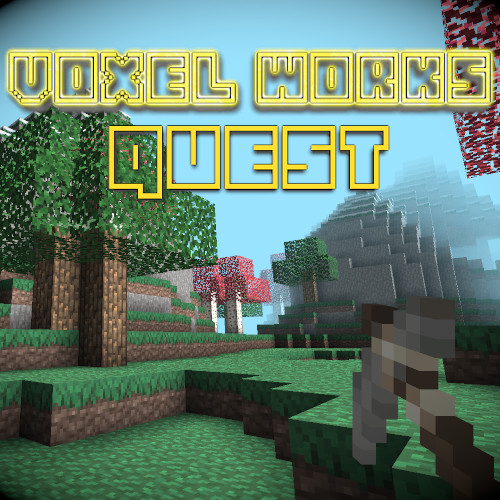
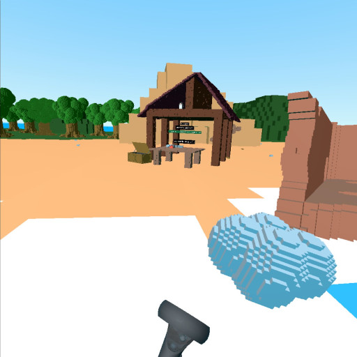
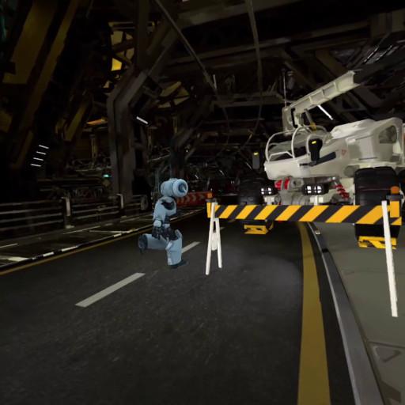
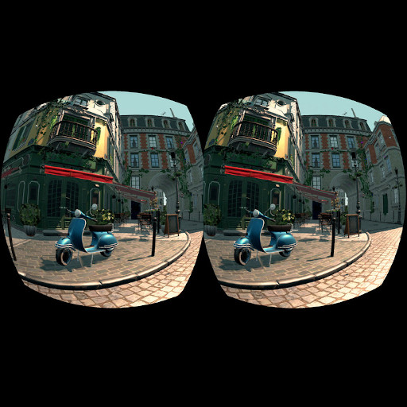
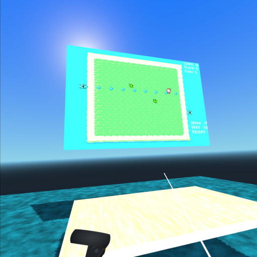
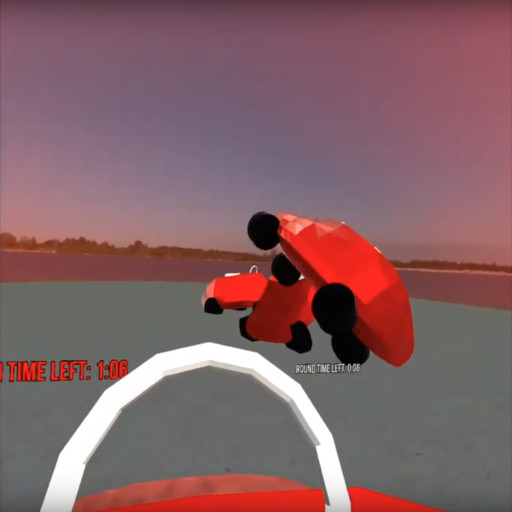
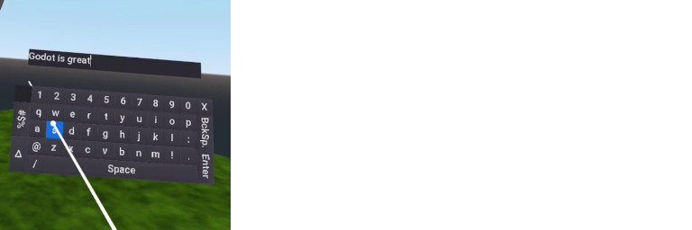

# Godot Oculus Quest Toolkit <!-- omit in toc --> 
This is an early alpha version of a toolkit for basic VR interactions with the Oculus Quest using the Godot game engine.
The toolkit in this repository requires (at the time of writing) a recent version of Godot 3.2.
If you have questions or run into problems please open an issue here or contact me at the [official Godot Discord](https://discord.gg/zH7NUgz): @NeoSpark314 or in the #XR channel.

## Showcases
A list of some projects and prototypes that use the Oculus Quest Toolkit that I'm aware of. If you are using the toolkit and would like to be here you can ping me or open an issue and I will add it.

| |  |  |
| |  |  |

## Features (so far... early alpha)
- Touch controller button handling and controller models
- 2D UI canvas with controller interaction
- Virtual Keyboard
- Hand Tracking support with included hand models and basic gesture detection
- VR Simulator and VR Recorder (for easier testing on desktop)
- Joystick locomotion and rotation (smooth and step)
- Walk in Place detection
- Falling and Climbing logic
- Rigid body grab
- Several utilities to accelerate prototyping and debugging (Log, Labels, ...)

# Documentation
The documentation is in the [project wiki](https://github.com/NeoSpark314/godot_oculus_quest_toolkit/wiki). It includes
a more detailed getting started section and an overview of the included features.

## Known issues

As this is a very early version there are some known issues that are not yet resolved. If you know a solution feel free to open a github issue to further discuss it or catch me on the [official Godot Discord](https://discord.gg/zH7NUgz): @NeoSpark314.

- No shader precompilation/caching. This means there will be a **very** noticeable hiccup when new objects/materials are rendered for the first time (like showing the UI pointer or when transitioning scenes). This will be essential to resolve for actual applications!
- No mip-mapping for UI canvas (thus text looks very bad at some distance)

## Planned features

There are a lot of potential extensions and missing features. Some of the things I think I will tackle next are on this list; but if you have some other suggestions feel free to open an issue to discuss it.

- Teleport movement option
- Jumping of ledges while climbing
- Grabbed objects
  - handing over objects
  - interaction trigger
- Improvements to the labeling system
- Physics interactors (levers, rotators, buttons, maybe doors)

# Credits
- The Medieval Town scene was created by fangzhangmnm: [Sketchfab Page](https://sketchfab.com/3d-models/medieval-town-a174a1449da345b8ab51308032587e71); released under [CC Attribution] (https://creativecommons.org/licenses/by/4.0/). The lightmap applied to the scene was baked in Blender.

# Licensing
The Godot Oculus Quest Toolkit and the demo scenes in this repository are licensed under an MIT License. The Oculus Touch controller 3d models the hand model and the Oculus Mobile SDK contained in this repository are copyright Oculus, see http://oculus.com for license information.
The Roboto font used is licensed under an Apache License and available at https://github.com/google/roboto.